# 🎨 AdaIN Neural Style Transfer

> **Real-time Arbitrary Style Transfer** using Adaptive Instance Normalization (AdaIN) — a PyTorch + Flask web application that lets you blend the content of any photograph with the artistic style of another image.

[](https://python.org)
[](https://pytorch.org)
[](https://flask.palletsprojects.com)
[](LICENSE)

---

## 📑 Table of Contents

- [Overview](#overview)
- [How It Works](#how-it-works)
- [Architecture](#architecture)
- [Project Structure](#project-structure)
- [Installation](#installation)
- [Usage](#usage)
  - [Training](#training)
  - [Web Application (Inference)](#web-application-inference)
- [Training Arguments](#training-arguments)
- [Results](#results)
- [API Reference](#api-reference)
- [Deployment](#deployment)
- [Tech Stack](#tech-stack)
- [References](#references)

---

## Overview

This project implements the paper **"Arbitrary Style Transfer in Real-time with Adaptive Instance Normalization"** by Xun Huang and Serge Belongie ([arXiv:1703.06868](https://arxiv.org/abs/1703.06868)).

Unlike optimization-based methods (Gatys et al.) that take minutes per image, AdaIN performs style transfer in a **single forward pass**, enabling real-time stylization. The key idea is to align the **mean** and **variance** of content features with those of style features in the VGG feature space.

### Key Features

- ⚡ **Real-time inference** — style transfer in a single forward pass
- 🎛️ **Alpha blending** — adjustable style strength slider (0.0 → 1.0)
- 🌐 **Web UI** — beautiful drag-and-drop Flask interface
- 🏋️ **Custom training** — train the decoder on your own dataset
- 📱 **Responsive design** — works on desktop and mobile
- ☁️ **Cloud-ready** — Procfile included for Heroku/cloud deployment

---

## How It Works

The AdaIN style transfer pipeline consists of three stages:

```
┌─────────────┐       ┌──────────────┐       ┌─────────────┐
│  Content     │       │              │       │             │
│  Image       │─────▶│  VGG-19      │──────▶│  Content    │
│              │       │  Encoder     │       │  Features   │─────┐
└─────────────┘       │  (frozen)    │       └─────────────┘     │
                      └──────────────┘                           │
                                                                 ▼
                                                          ┌──────────────┐
                                                          │   AdaIN      │
                                                          │              │
                                                          │ μ(content) → │──▶ Stylized
                                                          │   μ(style)   │    Features
                                                          │ σ(content) → │
                                                          │   σ(style)   │
                                                          └──────────────┘
                                                                 │
┌─────────────┐       ┌──────────────┐                           │
│  Style       │       │  VGG-19      │       ┌─────────────┐    │
│  Image       │──────▶│  Encoder     │──────▶│  Style      │────┘
│              │       │  (frozen)    │       │  Features   │
└─────────────┘       └──────────────┘       └─────────────┘
                                                                 │
                                                                 ▼
                                                          ┌──────────────┐
                                                          │   Decoder    │
                                                          │  (trained)   │──▶ Output Image
                                                          └──────────────┘
```

### AdaIN Formula

```
AdaIN(x, y) = σ(y) * ( (x − μ(x)) / σ(x) ) + μ(y)
```

Where:

- `x` = content features, `y` = style features
- `μ` = channel-wise mean, `σ` = channel-wise standard deviation

---

## Architecture

### VGG-19 Encoder (`utils/models.py` → `VGGEncoder`)

The encoder uses the first few layers (up to `relu4_1`) of a **pre-trained VGG-19** network (with normalized weights). It extracts multi-level features at four ReLU activation points:

| Block  | Layers                     | Output Channels | Feature Level |
| ------ | -------------------------- | --------------- | ------------- |
| `enc1` | Conv → ReLU (×2)           | 64              | `relu1_1`     |
| `enc2` | MaxPool → Conv → ReLU (×2) | 128             | `relu2_1`     |
| `enc3` | MaxPool → Conv → ReLU (×4) | 256             | `relu3_1`     |
| `enc4` | MaxPool → Conv → ReLU (×4) | 512             | `relu4_1`     |

- All encoder parameters are **frozen** (`requires_grad = False`)
- During **training**: returns all 4 feature maps `[h1, h2, h3, h4]` (for style loss)
- During **inference** (`is_test=True`): returns only `h4` (for speed)

### Decoder (`utils/models.py` → `Decoder`)

A symmetric decoder that mirrors the encoder architecture, reconstructing an image from the `relu4_1` feature space:

```
512ch → 256ch → Upsample(×2) → 256ch (×3) → 128ch → Upsample(×2) → 128ch → 64ch → Upsample(×2) → 64ch → 3ch
```

- Uses **ReflectionPad2d** (instead of zero-padding) to reduce border artifacts
- Uses **nearest-neighbor upsampling** (instead of transposed convolutions) for smoother results
- No batch normalization (to avoid interfering with AdaIN statistics)

### Core Functions (`utils/utils.py`)

| Function                                          | Description                                                                                    |
| ------------------------------------------------- | ---------------------------------------------------------------------------------------------- |
| `adaptive_instance_normalization(content, style)` | Performs the AdaIN operation — normalizes content features and re-scales with style statistics |
| `calc_mean_std(feat)`                             | Computes per-channel mean and standard deviation across spatial dimensions                     |
| `get_transform(size, crop, final_size)`           | Builds a torchvision transform pipeline for resizing/cropping training images                  |
| `ImageFolderDataset`                              | Custom PyTorch `Dataset` that loads `.jpg`/`.png`/`.jpeg` images from a flat directory         |

---

## Project Structure

```
NST_project/
│
├── app.py                    # Flask web server — inference routes & model loading
├── train.py                  # Training script — decoder training loop
├── requirements.txt          # Python dependencies (Flask, PyTorch, etc.)
├── Procfile.txt              # Cloud deployment config (Gunicorn)
├── .gitignore                # Git ignore rules
│
├── vgg_normalized.pth        # Pre-trained VGG-19 encoder weights (~80 MB)
├── decoder_final.pth         # Trained decoder weights (~14 MB)
│
├── utils/                    # Core ML modules
│   ├── __init__.py           # Package init
│   ├── models.py             # VGGEncoder & Decoder network definitions
│   └── utils.py              # AdaIN, calc_mean_std, dataset, transforms
│
├── templates/                # Flask HTML templates
│   └── index.html            # Main web UI (drag-and-drop, alpha slider, output display)
│
├── static/                   # Static web assets
│   ├── css/
│   │   └── style.css         # UI styles (glassmorphism, dark theme, animations)
│   ├── js/
│   │   └── main.js           # Frontend logic (file upload, API calls, download)
│   ├── uploads/              # Temporary uploaded images (runtime)
│   └── outputs/              # Generated stylized images (runtime)
│
├── content_data/             # Content training images (e.g., COCO test2017)
│   └── test2017/             # Content image dataset folder
│
├── style_data/               # Style training images (e.g., WikiArt)
│   └── train_2/              # Style image dataset folder
│
└── experiment/               # Training experiment outputs
    ├── experiment1/           # Experiment with decoder checkpoints
    │   ├── decoder.pth        # Saved decoder weights
    │   └── decoder_epoch302.pth
    └── Trial/                 # Trial run outputs
        ├── args.txt           # Saved training arguments
        ├── decoder1.pth       # Checkpoint at epoch 1
        ├── optimizer1.pth     # Optimizer state
        └── output_1.jpg       # Sample output grid (content | style | generated)
```

---

## Installation

### Prerequisites

- **Python 3.8+**
- **CUDA** (optional, for GPU acceleration)

### Steps

1. **Clone the repository**

   ```bash
   git clone https://github.com/BhupatiNadar/adain-neural-style-transfer.git
   cd adain-neural-style-transfer
   ```

2. **Create a virtual environment** (recommended)

   ```bash
   python -m venv venv
   source venv/bin/activate      # Linux/macOS
   venv\Scripts\activate         # Windows
   ```

3. **Install dependencies**

   ```bash
   pip install -r requirements.txt
   ```

4. **Download pre-trained weights**

   | File                 | Size   | Description                                     |
   | -------------------- | ------ | ----------------------------------------------- |
   | `vgg_normalized.pth` | ~80 MB | Pre-trained VGG-19 encoder (normalized weights) |
   | `decoder_final.pth`  | ~14 MB | Trained AdaIN decoder                           |

   Place both `.pth` files in the project root directory.

---

## Usage

### Web Application (Inference)

Launch the Flask web server:

```bash
python app.py
```

Then open [http://localhost:5000](http://localhost:5000) in your browser.

**How to use the web UI:**

1. **Upload a content image** — drag & drop or click the content zone
2. **Upload a style image** — drag & drop or click the style zone
3. **Adjust the alpha slider** — controls style intensity (0.0 = pure content, 1.0 = full stylization)
4. **Click "Generate"** — the stylized image appears in the output section
5. **Download** — click the download button to save the result

### Training

To train the decoder from scratch (or resume training):

```bash
python train.py \
  --content_dir ./content_data \
  --style_dir ./style_data \
  --vgg vgg_normalized.pth \
  --experiment my_experiment \
  --epochs 20 \
  --batch_size 4 \
  --lr 1e-4 \
  --content_weight 1.0 \
  --style_weight 10.0
```

To **resume** from a checkpoint:

```bash
python train.py \
  --resume \
  --decoder_path experiment/my_experiment/decoder10.pth \
  --optimizer_path experiment/my_experiment/optimizer10.pth \
  --epochs 20
```

**Training datasets:**

- **Content images**: [MS COCO](https://cocodataset.org/) (e.g., `test2017` split)
- **Style images**: [WikiArt](https://www.wikiart.org/) or any art dataset

---

## Training Arguments

| Argument           | Type    | Default              | Description                                         |
| ------------------ | ------- | -------------------- | --------------------------------------------------- |
| `--content_dir`    | `str`   | —                    | Path to content image directory                     |
| `--style_dir`      | `str`   | —                    | Path to style image directory                       |
| `--vgg`            | `str`   | `vgg_normalized.pth` | Path to pre-trained VGG-19 weights                  |
| `--experiment`     | `str`   | `experiment1`        | Experiment name (output folder under `experiment/`) |
| `--final_size`     | `int`   | `256`                | Final crop size for training images                 |
| `--content_size`   | `int`   | `512`                | Resize content images to this size before cropping  |
| `--style_size`     | `int`   | `512`                | Resize style images to this size before cropping    |
| `--crop`           | `flag`  | `True`               | Enable random cropping                              |
| `--batch_size`     | `int`   | `4`                  | Batch size                                          |
| `--lr`             | `float` | `1e-4`               | Learning rate                                       |
| `--lr_decay`       | `float` | `5e-5`               | Learning rate decay factor                          |
| `--epochs`         | `int`   | `2`                  | Number of training epochs                           |
| `--content_weight` | `float` | `1.0`                | Weight for content loss                             |
| `--style_weight`   | `float` | `10.0`               | Weight for style loss                               |
| `--log_interval`   | `int`   | `1`                  | Print loss every N epochs                           |
| `--save_interval`  | `int`   | `2`                  | Save checkpoint every N epochs                      |
| `--resume`         | `flag`  | `False`              | Resume training from checkpoint                     |
| `--decoder_path`   | `str`   | `None`               | Path to decoder checkpoint (for resuming)           |
| `--optimizer_path` | `str`   | `None`               | Path to optimizer checkpoint (for resuming)         |

### Training Loss

The total loss is a weighted sum of:

```
L_total = λ_content × L_content + λ_style × L_style
```

- **Content loss**: MSE between generated features at `relu4_1` and the AdaIN output `t`
- **Style loss**: Sum of MSE of mean and std between generated and style features at all 4 encoder levels (`relu1_1` through `relu4_1`)

---

## Results

### Style Transfer Examples

Add your own results by placing images in an `examples/` folder and updating the table below:

| Content Image | Style Image | Output (α=1.0) |
|:---:|:---:|:---:|
|  | 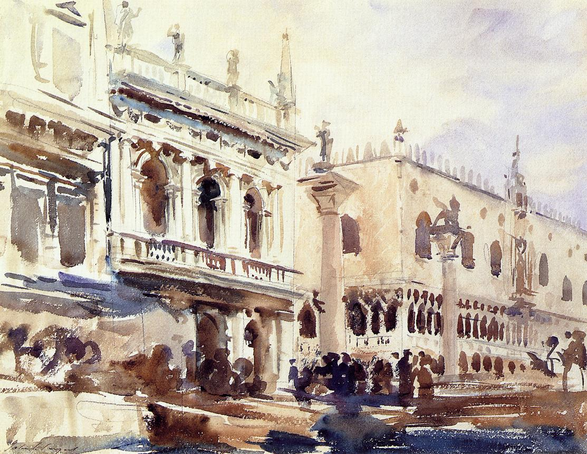 | 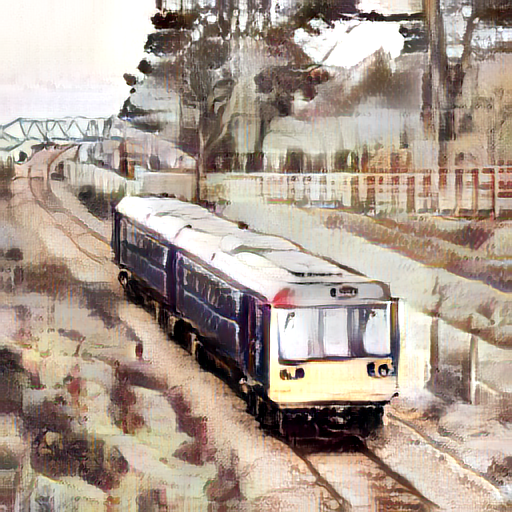 |
| 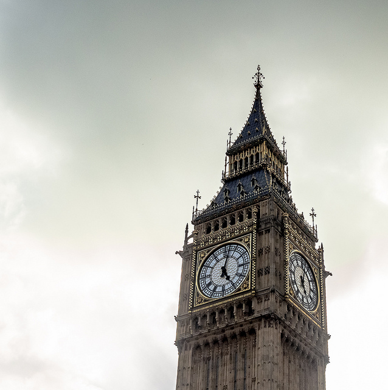 | 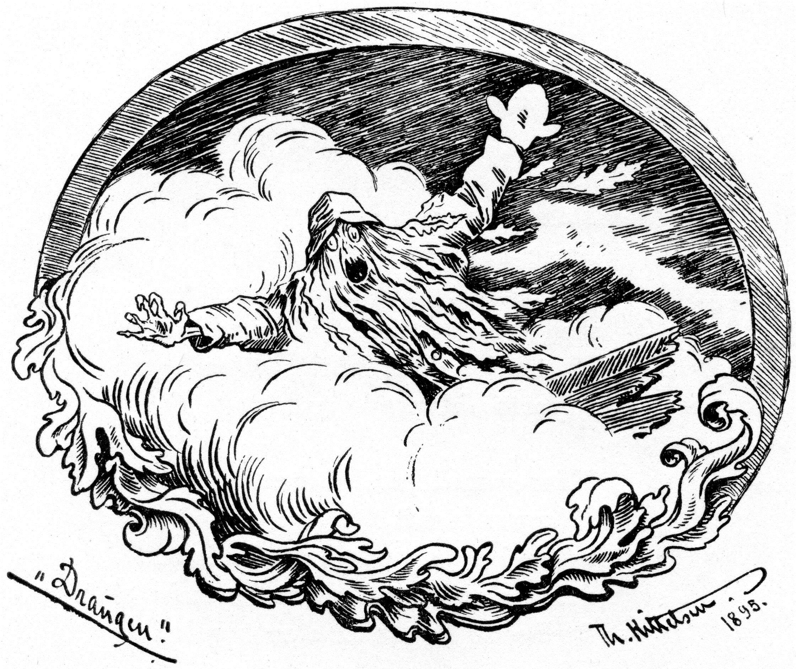 | 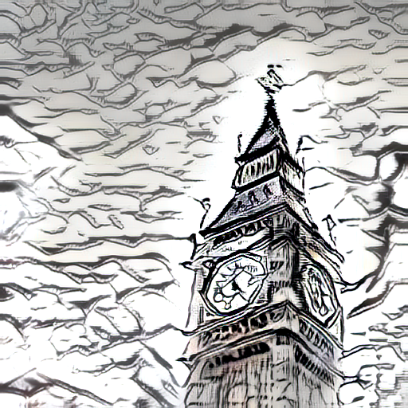 |
| 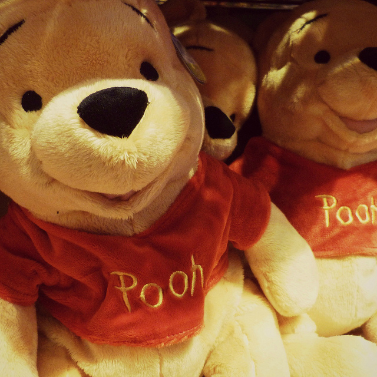 | 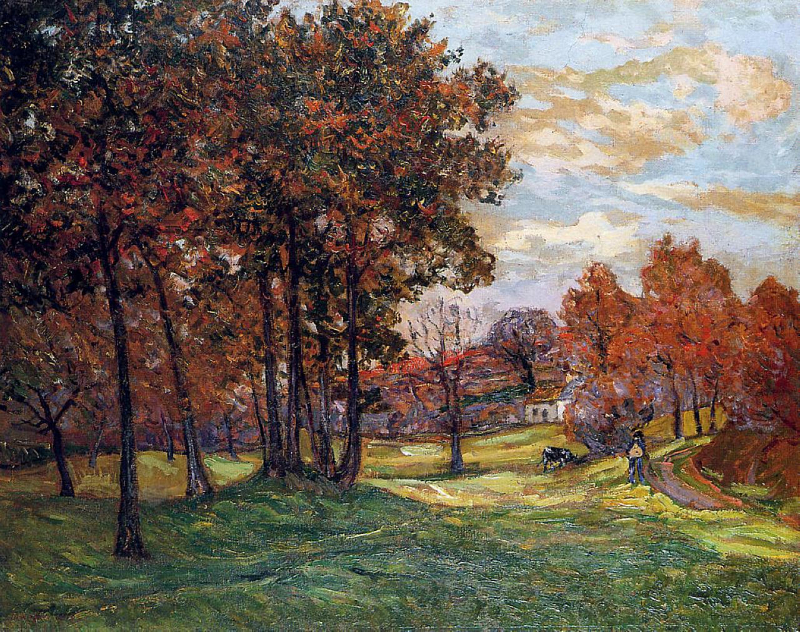 | 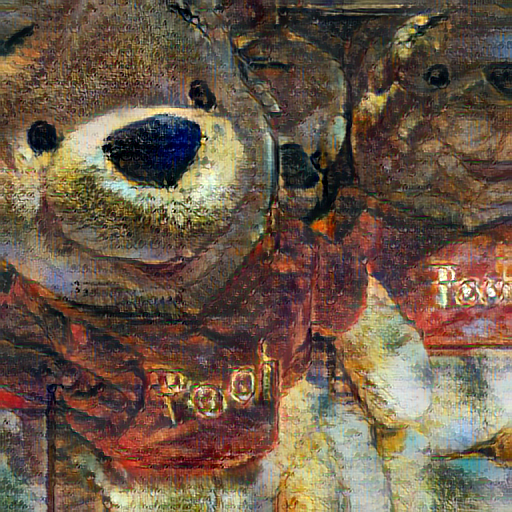 |

### Alpha Blending (Style Strength)

The `alpha` parameter controls how much of the style is applied. Here's how varying alpha affects the output:

| α = 0.0 (Content Only) | α = 0.25 | α = 0.5 | α = 0.75 | α = 1.0 (Full Style) |
|:---:|:---:|:---:|:---:|:---:|
| 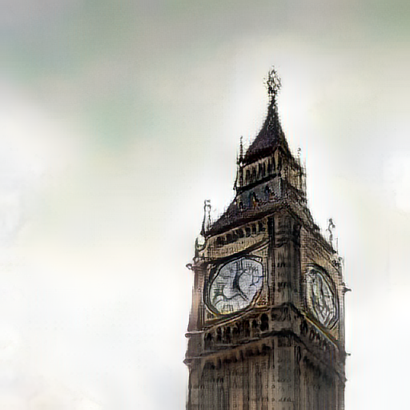 | 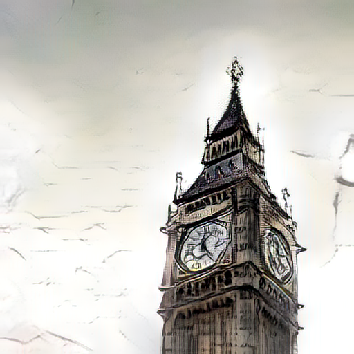 | 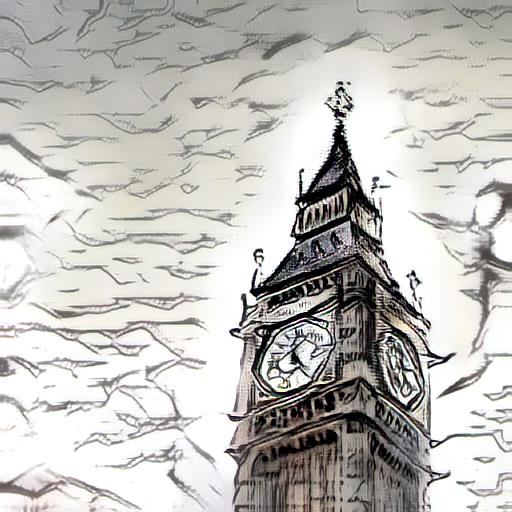 | 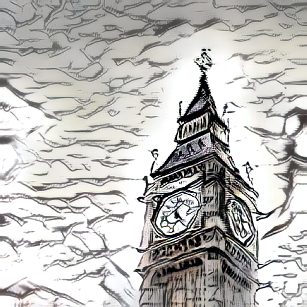 |  |

### Web Application Screenshot

<!-- Replace with an actual screenshot of your running web app -->

| 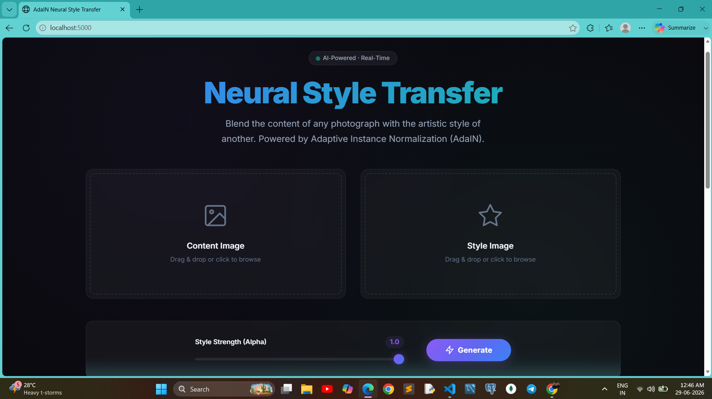 |
|:---:|
| *The AdaIN Neural Style Transfer web interface* |

### Training Progress

<!-- Replace with actual training output images from experiment/ folder -->

|                                           |
| :----------------------------------------------------------------------------------------: |
| _Training output grid — Row 1: Content batch, Row 2: Style batch, Row 3: Generated output_ |

---

## API Reference

### `POST /transfer`

Run style transfer on uploaded images.

**Request** (`multipart/form-data`):

| Field     | Type    | Required | Description                              |
| --------- | ------- | -------- | ---------------------------------------- |
| `content` | `file`  | ✅       | Content image (JPEG/PNG/WebP)            |
| `style`   | `file`  | ✅       | Style image (JPEG/PNG/WebP)              |
| `alpha`   | `float` | ❌       | Style strength, 0.0–1.0 (default: `1.0`) |

**Response**: `image/png` — the stylized output image

**Error Response** (`application/json`):

```json
{
  "error": "Both content and style images are required."
}
```

**Example** (cURL):

```bash
curl -X POST http://localhost:5000/transfer \
  -F "content=@photo.jpg" \
  -F "style=@painting.jpg" \
  -F "alpha=0.8" \
  --output stylized.png
```

### `GET /`

Serves the web UI (`templates/index.html`).

---

## Deployment

### Heroku / Cloud (Gunicorn)

The project includes a `Procfile.txt` for Gunicorn-based deployment:

```
web: gunicorn --bind :$PORT app:app
```

> **Note:** Rename `Procfile.txt` → `Procfile` (no extension) for Heroku deployments.

### Docker (Optional)

```dockerfile
FROM python:3.10-slim
WORKDIR /app
COPY requirements.txt .
RUN pip install --no-cache-dir -r requirements.txt
COPY . .
EXPOSE 5000
CMD ["gunicorn", "--bind", "0.0.0.0:5000", "app:app"]
```

---

## Tech Stack

| Component             | Technology                                      |
| --------------------- | ----------------------------------------------- |
| **Deep Learning**     | PyTorch, torchvision                            |
| **Encoder**           | VGG-19 (pre-trained, normalized weights)        |
| **Web Server**        | Flask                                           |
| **Frontend**          | HTML5, CSS3 (glassmorphism), Vanilla JavaScript |
| **Production Server** | Gunicorn                                        |
| **Training Data**     | MS COCO (content), WikiArt (style)              |

---

## References

1. **Huang, X., & Belongie, S.** (2017). _Arbitrary Style Transfer in Real-time with Adaptive Instance Normalization_. [arXiv:1703.06868](https://arxiv.org/abs/1703.06868)
2. **Gatys, L. A., Ecker, A. S., & Bethge, M.** (2016). _Image Style Transfer Using Convolutional Neural Networks_. CVPR 2016.
3. **Simonyan, K., & Zisserman, A.** (2015). _Very Deep Convolutional Networks for Large-Scale Image Recognition_. [arXiv:1409.1556](https://arxiv.org/abs/1409.1556)

---

<p align="center">
  Made with ❤️ using PyTorch & Flask
</p>
